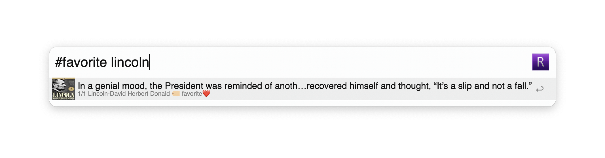

# alfred-readwise
## An Alfred Workflow for your [Readwise](https://readwise.io/) account
<a href="https://github.com/giovannicoppola/alfred-readwise/releases/latest/">
 
</a>
<a href="https://alfred.app/workflows/giovannicoppola/readwise/">
 
</a>

<!-- MarkdownTOC autolink="true" bracket="round" depth="3" autoanchor="true" -->

- [Motivation](#motivation)
- [Setting up](#setting-up)
- [Basic Usage](#usage)
- [Known Issues](#known-issues)
- [Acknowledgments](#acknowledgments)
- [Changelog](#changelog)
- [Feedback](#feedback)

<!-- /MarkdownTOC -->

<h1 id="motivation">Motivation ✅</h1>

- Quickly list, search, and open your Readwise highlights
- Add new highlights to your account through Alfred

<h1 id="setting-up">Setting up ⚙️</h1>

### Needed
- Alfred 5 with Powerpack license
- A [Readwise](https://readwise.io) license
- Python3 (howto [here](https://www.freecodecamp.org/news/python-version-on-mac-update/))
- Download `alfred-readwise` [latest release](https://github.com/giovannicoppola/alfred-readwise/releases/latest)

## Default settings 
- In Alfred, open the 'Configure Workflow' menu in `alfred-readwise` preferences
	- set the keyword for the workflow (default: `!r`)
	- set the keyword to force refresh (default: `readwise:refresh`) — syncs only what changed
	- set the keyword for a full rebuild (default: `readwise:rebuild`) — downloads everything again
	- set the Readwise API token (login into your account, then copy it [here](https://readwise.io/access_token))
	- set what to show in results: `books`, `tweets`, `supplementals`, `articles`, `podcasts`
	- set refresh rate (in days). Default: `30`
	- set 'book' name from highlights entered via Alfred. Default: `Highlights from Alfred`
	- set search scope. This applies to **Readwise highlights** only — Reader documents are always searched by title, author and site name, since those are how you look for an article:
		- `Main` (default): search the highlight text only
		- `Include metadata`: also search the book title and author. Note that an author match returns every highlight from that book.

<h1 id="usage">Basic Usage 📖</h1>

## Searching your Readwise database 🔍
- launch with keyword (default: `!r`), or custom hotkey
- standard search will be through highlight text and book titles. Multiple word (fragments) supported
- typing `#` will prompt a label search which can be added to the standard search, multiple labels supported
- type `--reader` or `--readwise` to restrict results to that platform for the current query
	- `enter` ↩️ will show the highlight in large font and copy to clipboard
	- `shift-enter` ⇧↩️ will show the highlight in large font and copy to clipboard without closing Alfred
	- `command-enter` ⌘↩️ will open the source URL if available (typically for tweets)
	- `ctrl-enter` ^↩️ will open the highlight on Readwise
	- `shift-ctrl-enter` ⇧^↩️ will open all highlights from that book on Readwise
	- `shift` alone: Quicklook of your highlight.

## Entering new highlights ⭐
- Universal Action: new highlights can be created by selecting text in any app, then launching Universal Actions and selecting `Create a new Readwise highlight`. The corresponding text will be assigned to a 'book' titled as set in `alfred-readwise` preferences (default: `Highlights from Alfred`).

## Database refresh 🔄
- will occur according to the rate in days set in `alfred-readwise` preferences, or...
	- `readwise:refresh` — sync just what changed since the last run. This is normally near-instant, because it asks the API only for highlights and documents updated since then.
	- `readwise:rebuild` — download everything again from scratch. Slower (minutes for a large library, as the API rate-limits long syncs), but it is the only way to remove highlights you deleted in Readwise, since an incremental sync cannot see deletions. This also runs automatically every 30 days.

<h1 id="known-issues">Limitations & known issues ⚠️</h1>

- None for now, but I have not done extensive testing, let me know if you see anything!

<h1 id="acknowledgments">Acknowledgments 😀</h1>

- Thanks to the [Alfred forum](https://www.alfredforum.com) community!
- Icons: 
	- https://www.iconarchive.com/show/multipurpose-alphabet-icons-by-hydrattz/Letter-R-violet-icon.html
	- https://www.flaticon.com/free-icon/book_3145755?term=book&related_id=3145755
	- https://www.flaticon.com/free-icon/podcast_2628834?term=podcast&page=1&position=8&origin=search&related_id=2628834
	- https://www.flaticon.com/free-icon/twitter_3670151?term=tweet&page=1&position=3&origin=search&related_id=3670151
	- https://www.flaticon.com/free-icon/additional_9710962?term=additional&page=1&position=12&origin=search&related_id=9710962
	- https://www.flaticon.com/free-icon/tags_1374863?term=label&page=1&position=19&origin=search&related_id=1374863
	- https://www.flaticon.com/free-icon/checkbox_1168610?term=done&page=1&position=18&origin=search&related_id=1168610
	- https://www.flaticon.com/free-icon/operating-system_10294204?term=update&page=1&position=30&origin=search&related_id=10294204

<h1 id="changelog">Changelog 🧰</h1>

### New in version 0.5
- Refreshes now sync only what changed instead of downloading everything each time, so a refresh that took minutes takes under a second. `readwise:rebuild` still does a full rebuild, and one runs automatically every 30 days to catch deletions
- Fixed a refresh that could never finish: hitting the Readwise rate limit retried forever, and because the search rebuilds a missing Reader table on every keystroke, each keystroke started another sync that rate-limited the others
- Searching for a word containing an apostrophe no longer fails, and TLS certificate verification is enabled again on both APIs
- Highlights created via Alfred are now stored correctly and are immediately searchable — previously the saved row had no text and could never be found
- Books with no cover art show the workflow icon instead of a blank placeholder image
- New `SEARCH_PLATFORM` setting: choose to search **Readwise** (default), **Reader**, or **Both**
- On a Reader document, `ctrl-enter` opens the Reader page and `cmd-enter` opens the original article — the same way `cmd-enter` opens the source of a highlight
- New `Open Reader documents in` setting: `Browser` (default) or `Reader app`. It controls where `ctrl-enter` opens a Reader page, and only matters when Reader documents are in your results. If the Reader app isn't installed it falls back to the browser
- Inline search filters: type `--reader` or `--readwise` anywhere in your query to restrict results to that platform, regardless of the `SEARCH_PLATFORM` setting
- Reader documents are always searched by title, author and site name; the `SEARCH_SCOPE` setting applies to highlights only
- Reader results now include summary and notes in the text view output
- Improved QuickLook highlight previews with better typography and layout
- API error handling with rate-limit retry and timeouts

- 04-04-2023: version 0.1

<h1 id="feedback">Feedback 🧐</h1>

Feedback welcome! If you notice a bug, or have ideas for new features, please feel free to get in touch either here, or on the [Alfred](https://www.alfredforum.com) forum. 
