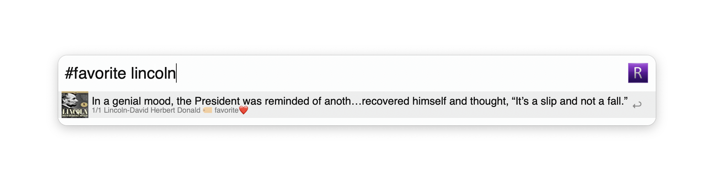

# alfred-readwise
## An Alfred Workflow for your [Readwise](https://readwise.io/) account
<a href="https://github.com/giovannicoppola/alfred-readwise/releases/latest/">
 
</a>
<a href="https://alfred.app/workflows/giovanni/readwise/">
 
</a>

<!-- MarkdownTOC autolink="true" bracket="round" depth="3" autoanchor="true" -->

- [Motivation](#motivation)
- [Setting up](#setting-up)
- [Basic Usage](#usage)
- [Favorites report](#favorites)
- [Library report](#library)
- [Known Issues](#known-issues)
- [Acknowledgments](#acknowledgments)
- [Changelog](#changelog)
- [Feedback](#feedback)

<!-- /MarkdownTOC -->

<h1 id="motivation">Motivation ✅</h1>

- Quickly list, search, and open your Readwise highlights and/or your Readwise Reader articles.
- Add new highlights to your account through Alfred

<h1 id="setting-up">Setting up ⚙️</h1>

### Needed
- Alfred 5 with Powerpack license
- A [Readwise](https://readwise.io) license
- Python3 (howto [here](https://www.freecodecamp.org/news/python-version-on-mac-update/))
- Download `alfred-readwise` [latest release](https://github.com/giovannicoppola/alfred-readwise/releases/latest)

## Default settings 
- In Alfred, open the 'Configure Workflow' menu in `alfred-readwise` preferences
	- set the keyword for the workflow (default: `!r`)
	- set the keyword to force refresh (default: `readwise:refresh`) — syncs only what changed
	- set the keyword for a full rebuild (default: `readwise:rebuild`) — downloads everything again
	- set the keyword for the favorites report (default: `!rfav`)
	- set the keyword for the library report (default: `!rstats`)
	- set the Readwise API token (login into your account, then copy it [here](https://readwise.io/access_token))
	- set what to show in results: `books`, `tweets`, `supplementals`, `articles`, `podcasts`
	- set refresh rate (in days). Default: `30`
	- set 'book' name from highlights entered via Alfred. Default: `Highlights from Alfred`
	- set **Search Platform** — which of your two Readwise libraries the workflow searches:
		- `Readwise` (default): your highlights only
		- `Reader`: your Readwise Reader documents only
		- `Readwise and Readwise Reader`: both, in one result list
		- whatever you pick here, you can override it for a single query with `--reader` or `--readwise` (see below)
	- set **Open Reader documents in** — where <kbd>^</kbd><kbd>↩</kbd> opens a Reader document:
		- `Browser` (default): opens `read.readwise.io` in your default browser
		- `Reader app`: opens the document in the Readwise Reader desktop app, falling back to the browser if it isn't installed
		- this setting only has an effect when Reader documents can appear in your results, i.e. when **Search Platform** includes Reader
	- set **Search Scope**. This applies to **Readwise highlights** only — Reader documents are always searched by title, author and site name, since those are how you look for an article:
		- `Main` (default): search the highlight text only
		- `Include metadata`: also search the book title and author. Note that an author match returns every highlight from that book.

<h1 id="usage">Basic Usage 📖</h1>

## Searching your Readwise database 🔍
- launch with keyword (default: `!r`), or custom hotkey
- standard search will be through highlight text and book titles. Multiple word (fragments) supported
- Reader documents, if included, are matched on title, author and site name
- type `--reader` or `--readwise` anywhere in the query to restrict results to that platform, whatever **Search Platform** is set to

### Labels 🏷️
- typing `#` brings up your labels, which can be combined with the standard search — multiple labels supported
- the list covers **both** your highlight tags and your Reader labels, and each one carries a count of how many items it holds, so you can see at a glance whether a label is worth filtering on
	- with both platforms in your results the count is split `highlights/documents` — e.g. `#genetics (12/48)` — since a single total would hide which library the label actually lives in
	- searching one platform only shows one number, counting just that platform
	- the count describes what picking the label would return, so it narrows with the rest of your query: `#` on its own counts your whole library, while `lincoln #` counts only among the Lincoln matches. Labels holding nothing in that context are left out
- labels appear in the result subtitle too, on Reader documents as well as highlights
- busiest labels are listed first
- a label filters both libraries independently: `#genetics` returns the highlights tagged `genetics` *and* the Reader documents labelled `genetics`, not everything in a library that happens to have any label

### Modifiers ⌨️
On a **highlight**:
- `enter` ↩️ will show the highlight in large font and copy to clipboard
- `shift-enter` ⇧↩️ will show the highlight in large font and copy to clipboard without closing Alfred
- `command-enter` ⌘↩️ will open the source URL if available (typically for tweets)
- `ctrl-enter` ^↩️ will open the highlight on Readwise
- `shift-ctrl-enter` ⇧^↩️ will open all highlights from that book on Readwise
- `shift` alone (or ⌘-Y): Quicklook of your highlight.

On a **Reader document**:
- `enter` ↩️ shows the title, author, summary and your notes in large font
- `ctrl-enter` ^↩️ opens the document in Reader — in the browser or in the Reader app, depending on **Open Reader documents in**
- `command-enter` ⌘↩️ opens the original article at its source URL

## Entering new highlights ⭐
- Universal Action: new highlights can be created by selecting text in any app, then launching Universal Actions and selecting `Create a new Readwise highlight`. The corresponding text will be assigned to a 'book' titled as set in `alfred-readwise` preferences (default: `Highlights from Alfred`).

## Database refresh 🔄
- will occur according to the rate in days set in `alfred-readwise` preferences, or...
	- `readwise:refresh` — sync just what changed since the last run. This is normally near-instant, because it asks the API only for highlights and documents updated since then.
	- `readwise:rebuild` — download everything again from scratch. Slower (minutes for a large library, as the API rate-limits long syncs), but it is the only way to remove highlights you deleted in Readwise, since an incremental sync cannot see deletions. This also runs automatically every 30 days.

<h1 id="favorites">Favorites report ❤️</h1>

`!rfav` (configurable) opens a report on the highlights you have **starred** in Readwise. Every
figure is given against the rest of your library, because a count on its own says very little: 14
favorites from one author is only interesting once you know whether you have 20 highlights from
them or 2,000.

The report opens in Alfred as a Markdown panel covering:

- **Authors** — who you star most, each against every highlight you have from them, with a `×`
  showing how much more (or less) often than your library-wide rate you starred them. A second,
  shorter list ranks the authors you star most *readily*, among those you have at least 10
  highlights from.
- **Length** — mean and median characters and words for your favorites, the rest of your library
  and the whole of it, plus how the two distributions differ.
- **Timeline** — a GitHub-style contribution calendar of the last 53 weeks, a compact all-time grid
  with one cell per month, and your busiest day, busiest month and longest streak.
- **Where they come from** — books, articles, tweets, podcasts and supplementals, each with its own
  favorite rate.
- **Most recent** — your five newest favorites, each linking straight to Readwise.

### Modifiers ⌨️
- `enter` ↩️ opens the full **HTML report** in your browser: every favorite you have, grouped by
  source, each linking to Readwise and to its original URL, with a filter box, the calendar in
  colour, and the complete author table
- `command-enter` ⌘↩️ copies the Markdown summary to the clipboard

The HTML report is rewritten every time you run the keyword, and lives next to the database in the
workflow's data folder, so it survives updates of the workflow itself.

<h1 id="library">Library report 📚</h1>

`!rstats` (configurable) is the same report for your **whole** library rather than the starred
part of it, on the same axes and with the same modifiers. Each slice is measured against the
library as a whole:

- **Your own highlights vs supplementals** — Readwise attaches a set of popular highlights to many
  books, and those *supplementals* are not passages you marked. They can easily outnumber the ones
  that are, so the report leads with the split — count, share, sources, authors, mean length and
  starred rate on both sides — rather than letting them quietly inflate every figure below.
- **Authors** — who you highlight most, their share of the library, and their mean highlight length
  against your library-wide average. Each row carries how many of its highlights are supplementals,
  since an author can sit near the top of the list without you ever having highlighted them
  yourself. Plus how concentrated your reading is: what share your top 10 and top 50 authors
  account for.
- **Most highlighted sources** — the books and articles you drew most from, each marked with its
  type (a whole source is either supplemental or not) and how many of them you starred.
- **Length** — mean, median, longest, shortest and total, in characters and in words, with the
  distribution.
- **Timeline** — the same calendars, plus busiest day, busiest month and longest streak.
- **Where they come from** — each category's share, its mean length against the library average,
  and the share of it you starred.

Its HTML report deliberately **does not list the highlights themselves**: at several thousand of
them the page would be enormous. It carries the complete author and source tables instead —
searching your highlights is what the main keyword is for, and the favorites report is where the
quotes live.

### Notes on both reports
- They read your Readwise **highlights** only. Readwise Reader documents are not covered: they
  carry no favorite flag, and a Reader document is a whole article rather than a passage, so it
  has no comparable length.
- They count *all* your highlights, whether or not their category is ticked in the workflow
  configuration; the category breakdown makes the split explicit.
- Alfred's Markdown only makes `http`/`https` links clickable, so the link to each report's HTML
  page is the <kbd>↩</kbd> action rather than a link in the text. The links to individual
  highlights are ordinary Markdown links and work as you would expect.

<h1 id="known-issues">Limitations & known issues ⚠️</h1>

- **QuickLook previews need Pillow.** <kbd>⌘</kbd><kbd>Y</kbd> on a highlight shows a typeset preview, but that needs the Python **Pillow** library, which is *not* bundled with the workflow — unlike `requests`, Pillow ships compiled code that cannot be vendored for both Apple Silicon and Intel from one copy. Without it the workflow runs normally and simply shows no preview. To enable them: `pip3 install --user Pillow`. Previews are being reworked to drop the dependency entirely — see [#5](https://github.com/giovannicoppola/alfred-readwise/issues/5).
- Otherwise nothing known, but I have not done extensive testing — let me know if you see anything!

<h1 id="acknowledgments">Acknowledgments 😀</h1>

- Thanks to the [Alfred forum](https://www.alfredforum.com) community!
- Icons: 
	- https://www.iconarchive.com/show/multipurpose-alphabet-icons-by-hydrattz/Letter-R-violet-icon.html
	- https://www.flaticon.com/free-icon/book_3145755?term=book&related_id=3145755
	- https://www.flaticon.com/free-icon/podcast_2628834?term=podcast&page=1&position=8&origin=search&related_id=2628834
	- https://www.flaticon.com/free-icon/twitter_3670151?term=tweet&page=1&position=3&origin=search&related_id=3670151
	- https://www.flaticon.com/free-icon/additional_9710962?term=additional&page=1&position=12&origin=search&related_id=9710962
	- https://www.flaticon.com/free-icon/tags_1374863?term=label&page=1&position=19&origin=search&related_id=1374863
	- https://www.flaticon.com/free-icon/checkbox_1168610?term=done&page=1&position=18&origin=search&related_id=1168610
	- https://www.flaticon.com/free-icon/operating-system_10294204?term=update&page=1&position=30&origin=search&related_id=10294204

<h1 id="changelog">Changelog 🧰</h1>

- **version 0.5 (upcoming)** — favorites and library reports (`!rfav` / `!rstats`), and a fix for the author showing as "None" on highlights added from Alfred.
- **2026-08-19: version 0.4** — Readwise Reader support, near-instant incremental refreshes, labels from both libraries with counts, and a batch of fixes. [Full release notes →](https://github.com/giovannicoppola/alfred-readwise/releases/tag/v0.4)
- 10-05-2023: version 0.3
- 04-04-2023: version 0.1

<h1 id="feedback">Feedback 🧐</h1>

Feedback welcome! If you notice a bug, or have ideas for new features, please feel free to get in touch either here, or on the [Alfred](https://www.alfredforum.com) forum. 
